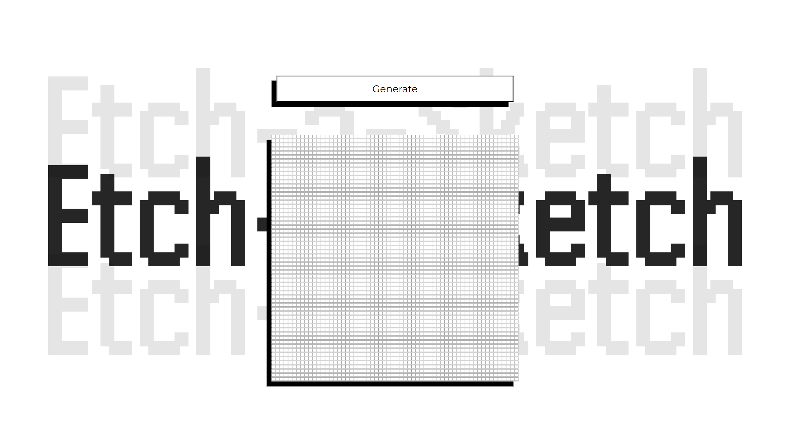

# 

 
 

This Etch-a-Sketch project was created as part of The Odin Project's Foundations Course, designed to strengthen DOM manipulation skills using JavaScript. Inspired by the classic Etch-A-Sketch toy, this browser-based sketchpad allows users to draw by hovering over grid squares, with additional functionality to resize the grid dynamically.

 Screenshot

  

    

## 📝 Project Objective

The objective of this project was to create a dynamic grid-based sketchpad where users can draw by hovering their mouse over the squares. The project required DOM manipulation to create the grid and handle interactions like changing colors and resizing the grid. Through this exercise, I aimed to deepen my understanding of JavaScript, specifically working with the DOM and event listeners.

## 🔧 Features

- **Dynamic Resizing**: Users can set the grid size (up to 100x100 squares) through prompts.

- **Hover Drawing**: Each square changes color when hovered over, simulating a drawing effect.

- **Responsive Grid**: The grid adjusts its total size to maintain a consistent drawing area.

- **Reset Button**: Clear the grid and set a new one via a button click.

## 📖 Learnings

This project was both challenging and fun, as it required a blend of JavaScript logic and CSS styling. It allowed me to reinforce my knowledge in the following areas:

- **DOM Manipulation**: Creating and appending multiple div elements dynamically using JavaScript.

- **Event Listeners**: Adding hover effects to each square to simulate the drawing process.

- **Flexbox Layout**: Flexbox was used to align the grid items and ensure they appeared as squares.

- **Dynamic CSS Styling**: Adjusting container dimensions and grid size through JavaScript to keep the layout responsive.

- **User Input Handling**:  Using prompt() to let users set the grid size while maintaining constraints.

## 💻 Technologies Used

- **HTML5** Structure and layout of the sketchpad.
- **CSS3** Styling for the grid and hover effects.
- **JavaScript** Logic for creating the grid, handling user interactions, and applying dynamic styles.

## 💡 Acknowledgments

- **The Odin Project**: For providing the project outline and guidance.
